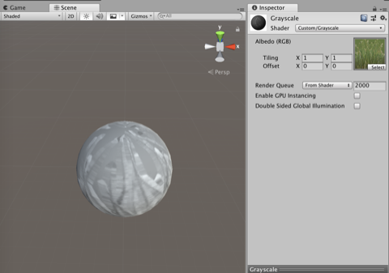
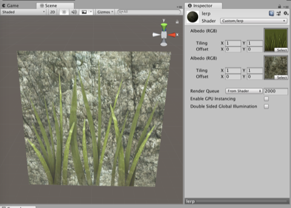
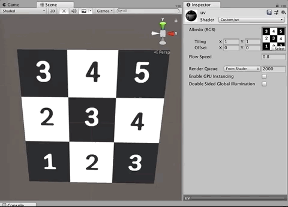
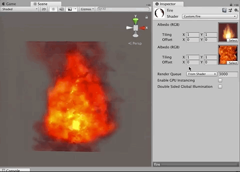
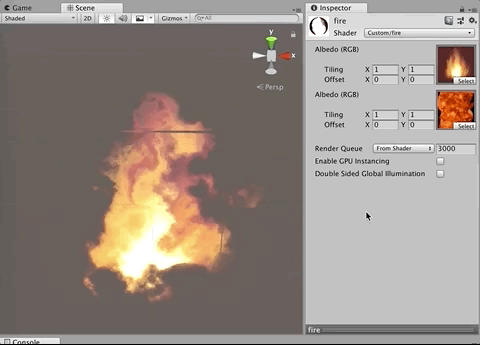
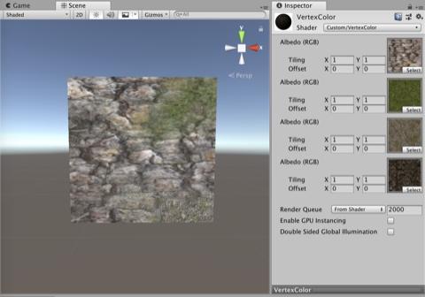
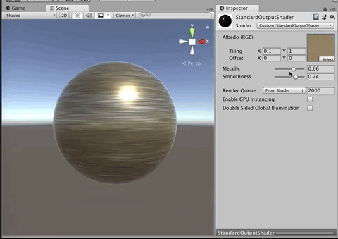
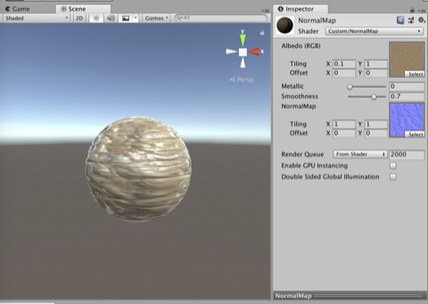
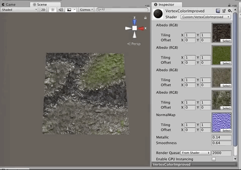
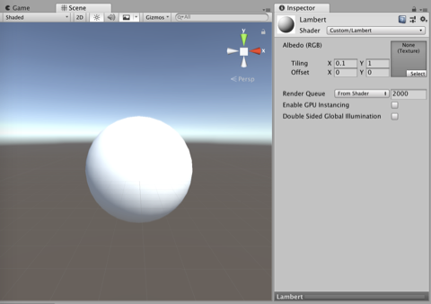

# Unity Shader Startup (유니티 쉐이더 스타트업)

## Chapter 1: What is a Shader

Technically, a shader is the function that outputs final pixel color for screen presentation.

But things is not that simple, cause it's just a description for programmers. A shader is not just a function but also has more somewhat emotional touch.

In the past, the shader language is super complicated, so only programmers can handle it, and could produce reliable and quality results.

As time goes on, hardwares have been improved. These days, emotional touch has much more priority than technical efficiency.

## Chapter 2: Prerequisites for Learning Shader

### Rendering Pipeline

Explaining full details about rendering pipeline needs tremendous amount of expertise, so we skip all details.

#### Step 1: Receive Object Data

Send vertex data which includes vertex index, position, normal, color, and such to GPU.

#### Step 2: Vertex Shader

Translate object coordinate to camera coordinate.

#### Step 3: Rasterizer

Convert 3D object to 2D image

#### Step 4: Pixel Shader / Fragment Shader

Calculate light, put shadow, sample texture, etc.

## Chapter 3: Layout of Unity Shader

Basically there's three ways to write shader using ShaderLab.

1. Use only ShaderLab language.
1. Surface Shader
1. Vertex & Fragment Shader

### Use only ShaderLab language

- Very light computation cost.
- Good hardware compatibility.
- Using Unity specific language, so not very well mixed with other shader syntax.
- Because of this, it's obsolete now.

### Surface Shader

- Basic lighting and the complex part of vertex shader are automatically handled.
- But when it comes to optimization, it's hard to reach quality result.
- And it's hard to use the case when the advanced technic should be applied.

### Vertex & Fragment Shader

- Hard to learn, but you can manually control all the part, so it's easy to optimize and good for applying advanced technic.

## Chapter 4: Making Basic Surface Shader

[Code](Project/Assets/Ch4)

### BrightDark Shader

## Chapter 5: Manipulating Texture with Surface Shader

[Code](Project/Assets/Ch5)

### Grayscale

### Lerp

## Chapter 6: Learn How to Use UV

[Code](Project/Assets/Ch6)

### UV

### Fire

### Fire2

## Chapter 7: Using Vertex Color

[Code](Project/Assets/Ch7)

### VertexColor

## Chapter 8: Using StandardOutputShader

[Code](Project/Assets/Ch8)

### StandardOutputShader

### NormalMap

### VertexColorImproved

## Chapter 9: Lambert & Blinn Phong

[Code](Project/Assets/Ch9)

### Types of Digital Lights

- Directional Light: Has only information like direction, intensity and color. The cheapest light.
- Point Light: The light proceeds as sphere shape. Has heavier computational cost than directional light.
- Spot Light: Highlights specific area. Also has heavy computational cost, so you should think about performance when use this kind of light.

### Lambert

### BlinnPhong

## Chapter 10: Manually Implement Lambert Lighting